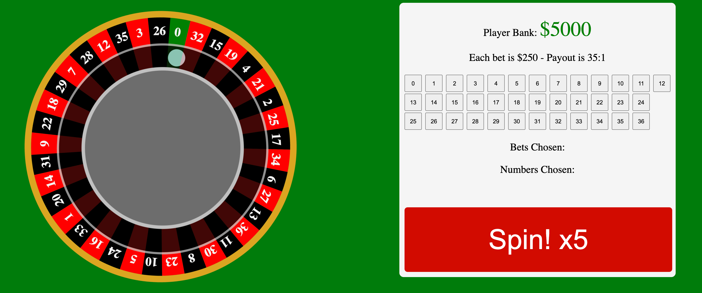

# Roulette

## Rules

- Payout is 35 to 1 (for example a $250 bet on a winning number will net $8,750).
- Player starts with $5000 in their bank.
- Each bet is worth $250.
- You can choose 1 to 5 bets on any number.
- You may also bet multiple times on the same number. This will multiply your payout (for example a $750 bet on the number zero can net $26,250).

## How To Play

- Choose up to 5 bets on any number.
- Click spin and the wheel will randomly output 5 numbers.
- If you win, money will be added to your bank. If no numbers match you lose your original bet.
- Bet again and repeat!

## Planned Features

- Add multiple bet values for players to choose (50, 250, 500, 1000).
- Match bet and winning numbers in seperate box.
- Show last 20 chosen numbers from wheel.
- Show visual confirmation of bet numbers in button box.
- Allow more than 5 spins depending on how many bets were chosen (if 8 bets were placed, spin the roulette wheel 8 times)

## Let's Play!

(link)
